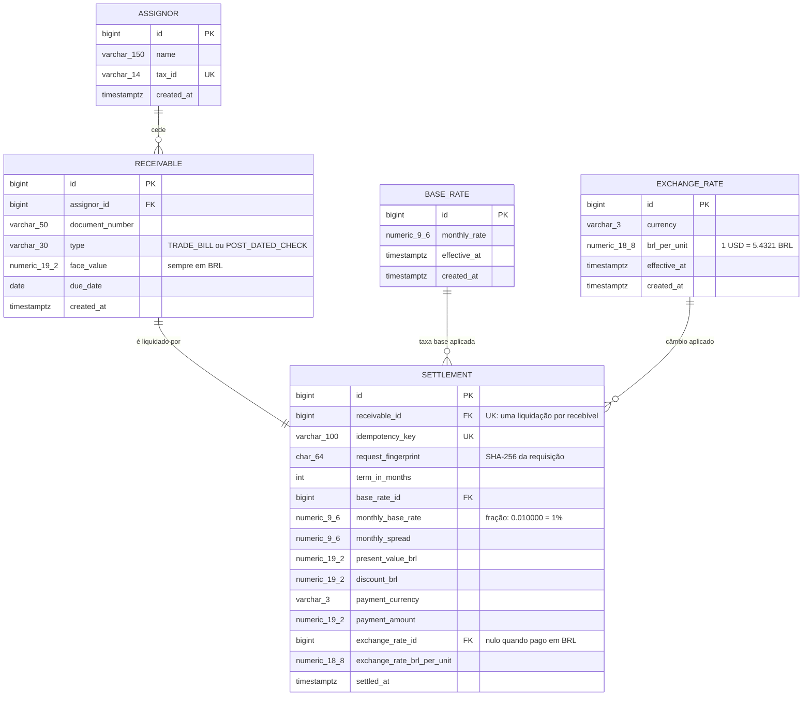

# Modelo de dados

## Como ler o modelo

**Fluxo do negócio.** Um **cedente** (`assignor`) vende seus **recebíveis** ao fundo. Cada recebível é liquidado uma única vez, e essa **liquidação** registra quanto o fundo pagou e com quais taxas.

**Normalização.** Cada informação aparece em um lugar só: o nome do cedente fica em `assignor`, os dados do título ficam em `receivable` e os valores calculados ficam em `settlement`. As tabelas de taxas guardam o histórico.

## Regras que o banco garante

| Regra | Como é garantida |
|---|---|
| Um recebível é liquidado no máximo uma vez | `UNIQUE (receivable_id)` em `settlement` |
| O mesmo título não é cadastrado duas vezes | `UNIQUE (assignor_id, type, document_number)` em `receivable` |
| Uma chave de idempotência gera uma liquidação | `UNIQUE (idempotency_key)` em `settlement` |
| Pagamento em moeda estrangeira sempre tem câmbio registrado, e pagamento em BRL nunca tem | `CHECK ck_settlement_exchange_rate` |
| Valores positivos e prazo de pelo menos um mês | `CHECK` em `face_value` e `term_in_months` |
| Nenhum registro é alterado ou apagado | Trigger `reject_mutation()` bloqueia `UPDATE` e `DELETE` nas cinco tabelas |

## Por que a liquidação copia as taxas

A liquidação guarda `monthly_base_rate`, `monthly_spread` e `exchange_rate_brl_per_unit`, além das chaves estrangeiras para as taxas de origem. Sem essa cópia, uma liquidação antiga deixaria de explicar o próprio cálculo assim que as taxas mudassem. As chaves estrangeiras mantêm a rastreabilidade de qual registro de taxa foi usado.

## Índices

| Índice | Para que serve |
|---|---|
| `idx_settlement_settled_at (settled_at DESC, id DESC)` | Ordem do extrato e paginação estável |
| `idx_settlement_currency_settled_at` | Filtro por moeda |
| `idx_receivable_assignor_id` | Filtro por cedente |
| `idx_base_rate_effective_at`, `idx_exchange_rate_currency_effective_at` | Busca da taxa vigente em uma data |

## Migrations

| Arquivo | Conteúdo |
|---|---|
| `V1__create_reference_rates.sql` | `base_rate`, `exchange_rate`, função `reject_mutation()` e triggers |
| `V2__seed_reference_rates.sql` | Taxa base de 1% a.m. e cotação USD 5,4321 |
| `V3__create_assignor_receivable_settlement.sql` | `assignor`, `receivable`, `settlement`, constraints, índices e triggers |
| `V4__seed_assignors.sql` | Três cedentes de exemplo |
